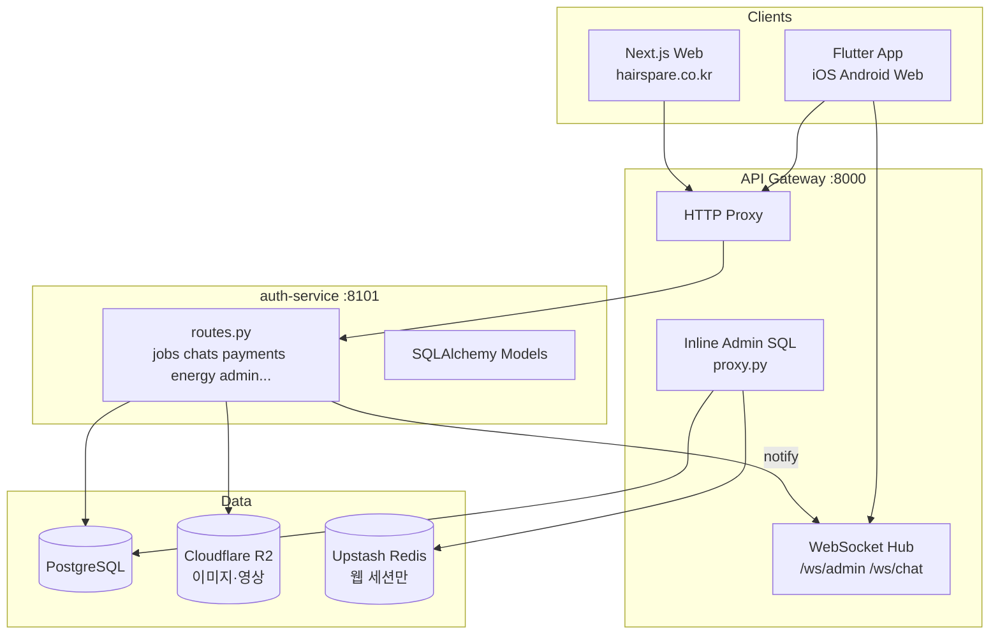
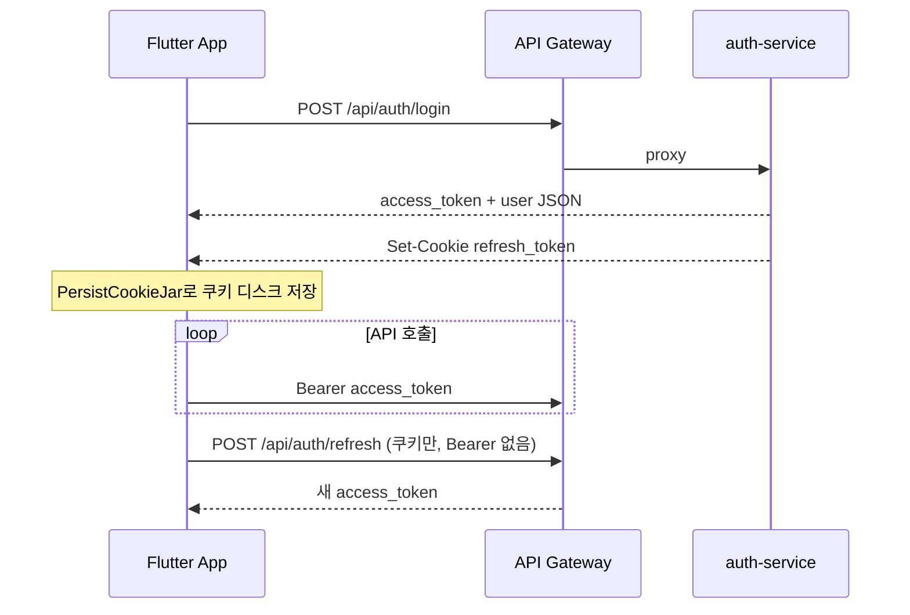
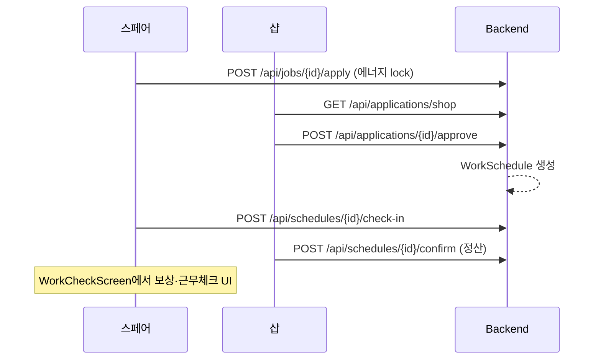
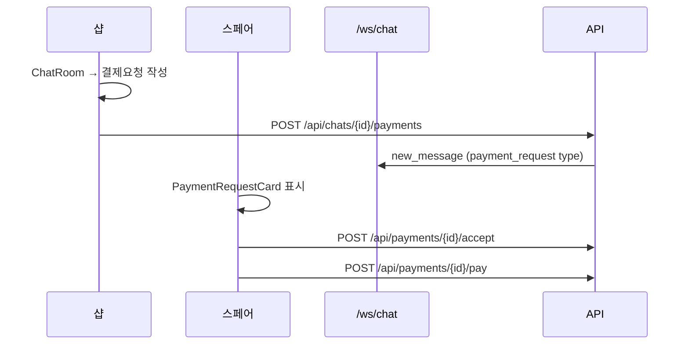
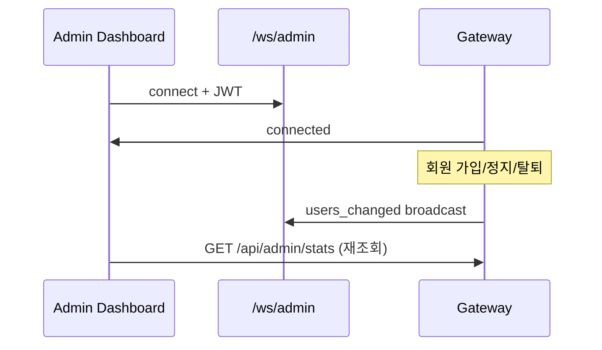

# HairSpare 앱 마스터 명세서 (APP MASTER SPEC)

> **작성 기준:** 2026-07-22 — Flutter `lib/` + Backend `/Users/yoram/backend-new` 코드를 직접 확인하여 작성  
> **목적:** 이 문서 **하나만** 읽어도 HairSpare가 무엇인지, 누가 쓰는지, 화면·버튼·API·데이터가 어떻게 연결되는지 이해할 수 있게 한다  
> **Sequential Thinking:** 문서 구조·플로우·코드 정합성은 Sequential Thinking MCP로 설계·검증함  
> **관련 문서:** 요약본 [`APP_FEATURES.md`](./APP_FEATURES.md) · 샵 상세 [`SHOP_PAGES_STRUCTURE.md`](./SHOP_PAGES_STRUCTURE.md) · 개발 브리핑 [`DEVELOPER_BRIEFING.md`](./DEVELOPER_BRIEFING.md)

---

## 목차

1. [한눈에 보는 HairSpare](#1-한눈에-보는-hairspare)
2. [회원 역할·페르소나](#2-회원-역할페르소나)
3. [시스템 아키텍처](#3-시스템-아키텍처)
4. [인증·토큰·소셜 로그인](#4-인증토큰소셜-로그인)
5. [앱 내비게이션·탭 구조](#5-앱-내비게이션탭-구조)
6. [핵심 비즈니스 플로우](#6-핵심-비즈니스-플로우)
7. [스페어(디자이너) 화면 상세](#7-스페어디자이너-화면-상세)
8. [모델(스페어 서브타입) 화면 상세](#8-모델스페어-서브타입-화면-상세)
9. [샵(미용실) 화면 상세](#9-샵미용실-화면-상세)
10. [관리자 화면 상세 (34화면)](#10-관리자-화면-상세-34화면)
11. [공통·인증 화면](#11-공통인증-화면)
12. [Shared Leaf Routes 부록](#12-shared-leaf-routes-부록)
13. [Flutter 서비스·Provider 계층](#13-flutter-서비스provider-계층)
14. [백엔드 API 레퍼런스](#14-백엔드-api-레퍼런스)
15. [WebSocket 실시간](#15-websocket-실시간)
16. [데이터 모델·DB 테이블](#16-데이터-모델db-테이블)
17. [미구현·Placeholder·Mock UI](#17-미구현placeholdermock-ui)
18. [운영·환경·URL](#18-운영환경url)

---

## 1. 한눈에 보는 HairSpare

### 1.1 제품 정의

**HairSpare**는 미용 업계에서 **스페어(구직 디자이너·모델)** 와 **샵(미용실)** 을 연결하는 크로스플랫폼 앱(Flutter)이다.

| 영역 | 설명 |
|------|------|
| **핵심 가치** | 급구·일반 공고 매칭, 근무 스케줄·체크인·정산, 1:1 채팅, 에너지(포인트) 경제 |
| **부가 기능** | 모델↔디자이너 스와이프 매칭, 챌린지 숏폼, 교육, 공간 대여, VIP 등급 |
| **관리** | Flutter 내장 **관리자 패널** (`/admin/*`, 34화면) + Next.js 웹(별도) |
| **백엔드** | FastAPI API Gateway + auth-service(실질 모놀리스), PostgreSQL, Upstash Redis(웹 세션 무효화) |

### 1.2 제품 대시보드 (역할 × 기능)

| 기능 도메인 | 스페어 | 모델 | 샵 | 관리자 |
|-------------|:------:|:----:|:--:|:------:|
| 공고 탐색·지원 | ✅ | — | — | 조회·숨김·삭제 |
| 공고 등록·지원자 승인 | — | — | ✅ | 조회 |
| 근무 스케줄·체크인 | ✅ | ✅ | ✅ | 강제 완료·노쇼 |
| 1:1 채팅 | ✅ | ✅ | ✅ | 고객센터 채팅 |
| 채팅 내 결제요청 | ✅(수납) | ✅ | ✅(요청) | 환불 |
| 에너지 구매·소비 | ✅ | ✅ | — | 원장 조정 |
| 모델 매칭(스와이프) | ✅(검색) | ✅(수신) | ✅(검색) | 강제 취소 |
| 챌린지 영상 | ✅ | ✅ | ✅(동일 화면) | 검수·숨김 |
| 교육 | ✅ | ✅ | 등록 | 숨김 |
| 공간 대여 | ✅(예약) | — | ✅(등록) | 예약 취소 |
| 본인·사업자 인증 | ✅ | ✅ | ✅(OCR) | 심사 |
| 회원 정지·탈퇴 | 탈퇴 | 탈퇴 | 탈퇴 | 정지·삭제 |

### 1.3 코드베이스 위치

| 저장소 | 경로 | 역할 |
|--------|------|------|
| **Flutter 앱** | `/Users/yoram/flutter` | iOS/Android/Web — 사용자·관리자 UI |
| **백엔드** | `/Users/yoram/backend-new` | API Gateway, auth-service, shared lib |
| **프로덕션 API** | `https://hairspare-backend-production.up.railway.app` | Railway 배포 |

---

## 2. 회원 역할·페르소나

### 2.1 UserRole (백엔드 `User.role`)

| role | 한글 | 설명 |
|------|------|------|
| `spare` | 스페어 | 구직 디자이너 (기본) |
| `shop` | 샵 | 미용실 사업자 |
| `admin` | 관리자 | `/admin` 패널 접근 |
| `seller` | (예약) | DB enum 존재, 앱 미사용 |

### 2.2 모델은 별도 role이 아님

- 회원가입 시 **「모델」** 선택 → `User.spare_subtype = model`
- 전용 라우트 prefix: `/model/*` (4탭 셸)
- API sender role: 채팅에서 `'model'` 로 표시

### 2.3 스토어 — 미구현 Placeholder

- 회원가입·홈 메뉴에 「스토어」 선택지 존재
- 탭 시 **「준비중입니다」** 모달만 표시 (`store_screen.dart`)
- 백엔드 store/cart/order 서비스는 health check stub

### 2.4 페르소나별 하단 탭

| Tab | 스페어 (`/spare/*`) | 모델 (`/model/*`) | 샵 (`/shop/*`) |
|-----|---------------------|-------------------|----------------|
| **0 홈** | `SpareHomeScreen` | `ModelHomeScreen` | `ShopHomeScreen` |
| **1** | `WorkCheckScreen` (근무) | `ModelMatchingStatusScreen` | `ShopPaymentScreen` |
| **2** | `FavoritesScreen` | `ModelScheduleScreen` | `ShopFavoritesScreen` |
| **3 마이** | `ProfileScreen` | `ModelProfileScreen` | `ShopProfileScreen` |

> **a안 IA (2026-07):** 스페어 Tab1은 **결제 → 근무**로 변경. 결제 내역은 마이 → 「결제 정보」(`/spare/profile/payment`)에서 접근.  
> **활성 탭 색:** 스페어 `#161616`, 샵 `#B3355C` (berry).

> **예외:** 스페어 계정이지만 `isModelAccount`이면 `/spare` 셸에서 Tab1→메시지, Tab2→스케줄로 스왑됨.

---

## 3. 시스템 아키텍처

### 3.1 전체 구조



### 3.2 Flutter 앱 레이어

```
lib/
├── main.dart                    # DI, MaterialApp.router
├── core/
│   ├── di/service_locator.dart  # get_it
│   ├── router/                  # go_router, AppRoutes, SharedLeafRoutes
│   └── services/                # GlobalMessengerService
├── models/                      # json_serializable
├── services/                    # API 호출 (JobService, ChatService...)
├── providers/                   # AuthProvider, ChatProvider...
├── view_models/                 # 화면별 ChangeNotifier
├── screens/                     # spare / shop / admin / common
└── widgets/                     # 기능별 UI 분리
```

**의존 방향:** `Screen/Widget` → `ViewModel/Provider` → `Service` → `ApiClient`

| 기술 | 선택 |
|------|------|
| UI | Flutter Material 3 |
| 상태 | `provider` (ChangeNotifier) |
| DI | `get_it` |
| 라우팅 | `go_router` + StatefulShellRoute (탭) |
| HTTP | `dio` + `AuthInterceptor` (토큰 갱신) |
| WS | `web_socket_channel` |

### 3.3 백엔드 — MSA vs 실제

Docker Compose에는 job/schedule/chat/energy 등 **별도 마이크로서비스**가 있으나, **Gateway는 대부분 auth-service로 프록시**한다. 즉 운영상 auth-service가 사실상 **도메인 모놀리스**다.

| Gateway prefix | 실제 처리 |
|----------------|-----------|
| `/api/auth/*`, `/api/jobs/*`, `/api/chats/*`, `/api/schedules/*`, `/api/payments/*`, `/api/energy/*` | auth-service |
| `/api/admin/stats`, `/api/admin/users/*`, audit-logs, reference... | Gateway inline SQL |
| `/api/store/*` | stub services |
| `/api/space-rentals/*` | Gateway 501 |

---

## 4. 인증·토큰·소셜 로그인

### 4.1 JWT 이중 토큰

| 토큰 | 수명 | 저장 | 용도 |
|------|------|------|------|
| **Access** | **15분** | 앱 메모리 + Authorization 헤더 | 모든 API |
| **Refresh** | **7일** | HttpOnly Cookie `refresh_token`, Path=`/api/auth` | `POST /api/auth/refresh` |

### 4.2 로그인 플로우



**Public paths (Gateway middleware):** login, register, refresh, logout, social, verification, `/health`, `/ws/*`, `/internal/*`

### 4.3 소셜 로그인

| Provider | Flutter | Backend endpoint | 비고 |
|----------|---------|------------------|------|
| Kakao | `SocialAuthService` | `POST /api/auth/social/kakao` | accessToken |
| Naver | 동일 | `POST /api/auth/social/naver` | accessToken |
| Google | `GoogleSignIn` | `POST /api/auth/social/google` | idToken, aud 검증 |
| Apple | Sign in with Apple | `POST /api/auth/social/apple` | identityToken |

- 소셜 가입 기본 role: `spare`
- 탈퇴(`is_deleted`) 계정 재가입 시 internal purge 후 재생성

### 4.4 통합 로그인 화면

- 경로: `/`, `/spare/login`, `/shop/login` → 동일 `SpareLoginScreen`
- `login_type` 파라미터로 spare/shop 포털 구분 (role mismatch 시 거부)

### 4.5 회원탈퇴

- 화면: `{branch}/settings_delete_account`
- API: `DELETE /api/auth/delete-account`
- 즉시 soft delete 응답 → 백그라운드 hard delete
- Flutter: 성공 후 **`AuthProvider.logout()`** 필수 (홈 리다이렉트)

---

## 5. 앱 내비게이션·탭 구조

### 5.1 라우트 트리 (요약)

```
/                           → 로그인 (역할 선택)
/privacy                    → 개인정보 처리방침
/spare/signup/*             → 스페어·모델 가입
/shop/signup/*              → 샵 가입

/spare/home/*               → 스페어 Tab0 + 하위 push
/spare/payment/*            → Tab1
/spare/favorites/*          → Tab2
/spare/profile/*            → Tab3

/model/home/*               → 모델 Tab0
/model/matching/*           → Tab1
/model/schedule/*           → Tab2
/model/profile/*            → Tab3

/shop/home/*                → 샵 Tab0
/shop/payment/*             → Tab1
/shop/favorites/*           → Tab2
/shop/profile/*             → Tab3

/admin/*                    → 관리자 ShellRoute (사이드바)
```

### 5.2 공통 헤더 버튼 (스페어·샵·모델 홈)

| 버튼 | 동작 | 목적지 |
|------|------|--------|
| 로고 | (스크롤 시) | — |
| 검색 | push | `/spare/home/search` 또는 `/shop/home/search` |
| 메시지 | push + unread 배지 | `…/messages` |
| 알림 | push | `…/notifications` |

### 5.3 Shared Leaf Routes

모든 탭 브랜치에 **동일 suffix**가 붙는다. 예: `/spare/home/job/abc`, `/spare/profile/job/abc` 모두 `JobDetailScreen`.

→ [12. Shared Leaf Routes 부록](#12-shared-leaf-routes-부록) 참조

---

## 6. 핵심 비즈니스 플로우

### 6.1 공고 지원 → 승인 → 스케줄 → 체크인 → 정산



| 단계 | 스페어 UI | 샵 UI | API |
|------|-----------|-------|-----|
| 지원 | `JobDetailScreen` → 지원하기 | — | `POST …/apply` |
| 승인 | `MyApplicationsScreen` 상태 변경 | `ShopApplicantsScreen` → 승인 | `POST …/approve` |
| 스케줄 확인 | `WorkCheckScreen` | `ShopScheduleScreen` | `GET /api/schedules` |
| 체크인 | WorkCheck → 체크인 버튼 | — | `POST …/check-in` |
| 정산 | — | Schedule → 확인/정산 | `POST …/confirm` |
| 정산 취소 요청 | — | 완료 카드 탭 → 사유 입력 | `POST …/settlement-cancel-request` |
| 노쇼 신고 | — | 「노쇼 신고」링크 | `POST …/no-show-report` |

### 6.2 채팅 + 결제요청 카드



| 버튼 (ChatRoomScreen) | 역할 | API |
|----------------------|------|-----|
| 메시지 전송 | 텍스트 전송 (연락처 차단 검사) | `POST /api/messages` |
| 결제요청 (샵) | `PaymentRequestComposeSheet` | `POST /api/chats/{id}/payments` |
| 수락/거절 (스페어) | `PaymentRequestCard` | accept/decline |
| 결제하기 | `PaymentRequestScreen` | pay |
| 나가기/삭제 | 채팅방 삭제 | `DELETE /api/chats/{id}` |
| 신고 | `ReportSheet` | `POST /api/reports` |
| 차단 | — | block API |

**연락처 노출 차단:** `ContactViolationService` — 3회 위반 시 대화방 삭제 + 샵 패널티

### 6.3 모델 매칭

| 경로 | 화면 | 핵심 버튼 |
|------|------|-----------|
| `/spare/home/model_match` | `ModelMatchEntryScreen` | 조건으로 찾기 / 날짜로 찾기 |
| `…/filter` | `ModelMatchFilterScreen` | 필터 칩 → 시작 |
| `…/swipe` | `ModelMatchSwipeScreen` | Pass / Like / Undo |
| `…/by_date` | `ModelDateSearchScreen` | 날짜 선택 → 프로필 |
| `/model/matching` | `ModelMatchingStatusScreen` | 받은 관심 → 수락/거절 |
| `…/match_like/:id` | `MatchProfileDetailScreen` | 수락 → 채팅 생성 |

API: `/api/model-match/*`, `/api/matching/*`

### 6.4 에너지(포인트) 경제

| 화면 | 동작 | API |
|------|------|-----|
| `EnergyScreen` | 잔액·내역 | `GET /api/energy/wallet`, `/transactions` |
| `EnergyPurchaseScreen` | 패키지 선택 | — |
| `EnergyPurchaseCheckoutScreen` | 결제 확인 | `POST /api/energy/purchase` |
| `EducationEnergyCheckoutScreen` | 교육 신청 결제 | spend |
| 공고 지원 | 자동 lock | apply 시 energy_locked |

### 6.5 관리자 실시간 + 회원 정지



---

## 7. 스페어(디자이너) 화면 상세

> **총 70+ screen 파일** (spare/ 폴더). Tier1 = 탭·핵심 플로우는 버튼까지, Tier2 = leaf 표 요약.

### 7.1 Tab0 — 홈 (`SpareHomeScreen`)

**경로:** `/spare/home`  
**파일:** `screens/spare/home_screen.dart` + `widgets/spare_home/*`

#### UI 구성

| 영역 | 위젯 | 설명 |
|------|------|------|
| Sticky 헤더 | `SpareHomeAppBarRow` | 검색·메시지·알림 |
| 히어로 배너 | `StitchHeroBanner` | CTA 탭 시 급구 공고 목록 |
| 퀵 메뉴 4칸 | `CategoryGrid` + `SpareHomeQuickMenu` | 아래 표 |
| 공고 섹션 | `SpareHomeJobSections` | 급구·추천·일반 등 |

#### 퀵 메뉴 버튼

| 라벨 | 탭 동작 | 목적지 |
|------|---------|--------|
| 공고정보 | push | `/spare/home/jobs` |
| 내 스케줄 | push | `/spare/home/work_check` |
| 챌린지참여 | push | `/spare/home/challenge` |
| 모델검색 | push | `/spare/home/model_match` |

#### 배너 CTA

| 배너 index | 동작 |
|------------|------|
| 0 | `/spare/home/jobs?filter=urgent` (급구) |
| 기타 | (미연결) |

#### 공고 카드 액션

| 액션 | API/Provider |
|------|--------------|
| 카드 탭 | → `JobDetailScreen` |
| ♥ 찜 | `FavoriteProvider.toggleFavorite` → `/api/favorites` |
| 새로고침 (에러 시) | `JobProvider.refreshJobs` |

**폴링:** bare home(`/spare/home`)일 때만 `SpareHomeViewModel.startPolling()`

---

### 7.2 Tab1 — 근무 (`WorkCheckScreen`)

**경로:** `/spare/work` (구 `/spare/payment` → redirect)  
**기능:** 근무 스케줄·주간 캘린더·체크인·연속 근무 이벤트  
**하위:** 채팅 leaf routes 공유

> 결제 내역·에너지 구매는 **마이 → 결제 정보** (`/spare/profile/payment`) 또는 채팅 결제요청 플로우.

---

### 7.3 Tab2 — 찜 (`FavoritesScreen`)

**경로:** `/spare/favorites`  
**기능:** 찜한 공고 목록, 찜 해제, 공고 상세 이동  
**서비스:** `FavoriteService`, `FavoriteProvider`  
**Shared leaf:** `…/favorites/job/:jobId`

---

### 7.4 Tab3 — 마이 (`ProfileScreen`)

**경로:** `/spare/profile`  
**구성:** 헤더(아바타·통계) + `SpareProfileMenuSection`

#### 마이 탭 메뉴 (버튼 → 목적지)

| 메뉴 | 설명 | 목적지 |
|------|------|--------|
| 챌린지 프로필 | 영상·크리에이터 프로필 | `/spare/profile/challenge` |
| 구독한 크리에이터 | 구독 목록 | `/spare/profile/subscriptions` |
| 작업 포트폴리오 | 매칭용 사진 | `/spare/profile/portfolio` |
| 내 스케줄 | 근무·체크인 | `/spare/profile/work_check` |
| 내 지원 현황 | 공고 지원 상태 | `/spare/profile/applications` |
| 결제 정보 | 결제·구독 내역 | `/spare/profile/payment` (또는 Tab1) |
| 추천하기 | 추천 코드 | `/spare/profile/referral` |
| 인증 관리 | PortOne 본인인증 | `/spare/profile/verification` |
| 설정 | 비번·알림·탈퇴 | `/spare/profile/settings` |

---

### 7.5 홈 branch 주요 Push 화면

#### 7.5.1 공고 목록 (`JobsListScreen`)

| 항목 | 내용 |
|------|------|
| **경로** | `/spare/home/jobs?filter&sort&q` |
| **필터** | urgent, region, sort mode |
| **카드 탭** | `JobDetailScreen` |
| **♥** | FavoriteProvider |
| **API** | `GET /api/jobs` |

#### 7.5.2 공고 상세 (`JobDetailScreen`)

| 버튼 | 동작 | API |
|------|------|-----|
| 지원하기 | 에너지 lock + 지원 | `POST /api/jobs/{id}/apply` |
| 찜 | toggle | favorites |
| 공유 | share sheet | — |
| 샵 문의 | ensure chat | `POST /api/chats/ensure` |
| 새로고침 (에러) | reload | `GET /api/jobs/{id}` |

#### 7.5.3 통합 검색 (`SearchScreen`)

| 항목 | 내용 |
|------|------|
| **경로** | `/spare/home/search` |
| **탭** | 공고 / 교육 / 공간 / 챌린지 |
| **서비스** | `SearchService` |

#### 7.5.4 메시지 (`MessagesScreen`)

| 버튼 | 동작 |
|------|------|
| 채팅 row 탭 | `ChatRoomScreen` |
| 스와이프 삭제 | `DELETE /api/chats/{id}` |
| pull refresh | `ChatProvider.loadChats` |

#### 7.5.5 채팅방 (`ChatRoomScreen`)

→ [6.2 채팅 + 결제요청](#62-채팅--결제요청-카드) 참조  
**실시간:** `ChatRealtimeService` → `WS /ws/chat`  
**폴링:** WS 실패 시 fallback poll

#### 7.5.6 근무체크·스케줄 (`WorkCheckScreen`)

| 항목 | 내용 |
|------|------|
| **경로** | `/spare/home/work_check`, `/spare/profile/work_check` |
| **UI** | 월 캘린더 + 선택일 하단 상세 (`WorkCheckSelectedDateSection`) |
| **버튼** | 체크인, 근무 종료, 교육 카드, 제안 카드 |
| **ViewModel** | `WorkCheckViewModel` |
| **API** | schedules, work-check |

#### 7.5.7 챌린지 (`ChallengeScreen`)

| 버튼 | 동작 |
|------|------|
| 영상 스와이프 | immersive feed |
| 업로드 | `POST /api/challenges` |
| 좋아요/댓글 | comments screen (imperative push) |
| 크리에이터 프로필 | `ChallengeProfileScreen` |

#### 7.5.8 교육 (`EducationScreen` → `EducationDetailScreen`)

| 버튼 | 동작 |
|------|------|
| 필터 | 지역·카테고리·날짜 |
| 상세 | enroll → `EducationEnergyCheckoutScreen` |
| **참고** | 목록 데이터 일부 mock |

#### 7.5.9 에너지 (`EnergyScreen`)

| 버튼 | 목적지 |
|------|--------|
| 충전하기 | `energy_purchase` shared leaf |
| 내역 | transactions list |

#### 7.5.10 모델 매칭 진입~스와이프

→ [8. 모델](#8-모델스페어-서브타입-화면-상세) 및 [6.3](#63-모델-매칭)

#### 7.5.11 공간 대여 (`RegionSelectScreen` → `SpaceRentalDetailScreen`)

| 버튼 | API |
|------|-----|
| 지역 필터 | regions |
| 슬롯 선택·예약 | space-rental (일부 501) |

#### 7.5.12 포인트 (`PointsScreen`) — ⚠️ Mock UI

| 항목 | 내용 |
|------|------|
| **경로** | `/spare/home/points` |
| **상태** | 출석체크·미션 UI 존재, **실 API 연동 없음** (mock data) |

---

### 7.6 설정 (`SettingsScreen`)

**경로:** `/spare/profile/settings`, `/model/profile/settings`

| 메뉴 | 목적지 |
|------|--------|
| 프로필 수정 | `settings_profile_edit` |
| 알림 설정 | `settings_notifications` |
| 비밀번호 변경 | `settings_change_password` |
| 회원탈퇴 | `settings_delete_account` |
| 로그아웃 | `AuthProvider.logout()` |

---

### 7.7 스페어 Tier2 화면 요약표

| 화면 | 경로 suffix | 핵심 API |
|------|-------------|----------|
| `EnergyPurchaseScreen` | `energy_purchase` | energy packages |
| `EnergyPurchaseCheckoutScreen` | `energy_checkout` | purchase |
| `EducationEnergyCheckoutScreen` | `education_checkout` | spend |
| `EducationEnrollmentDetailScreen` | `enrollment/:id` | enrollment |
| `PaymentRequestScreen` | `payment_request_pay` | pay |
| `PointHistoryScreen` | `point_history` | PointProvider |
| `VerificationScreen` | `verification` | PortOne |
| `ChallengeProfileScreen` | `challenge_profile` | challenge API |
| `ChallengeProfileEditScreen` | `challenge_profile_edit` | upload |
| `ProfileEditScreen` | `settings_profile_edit` | `PUT /api/users/profile` |
| `ChangePasswordScreen` | `settings_change_password` | change-password |
| `DeleteAccountScreen` | `settings_delete_account` | delete-account |
| `NotificationsSettingsScreen` | `settings_notifications` | notification settings |
| `ReviewsListScreen` | `reviews` | extra로 전달 |
| `PortfolioScreen` | `/spare/profile/portfolio` | portfolio API |
| `MyApplicationsScreen` | `/spare/profile/applications` | applications/my |
| `MySpaceBookingsScreen` | `/spare/profile/space_bookings` | bookings |
| `ReferralScreen` | `/spare/profile/referral` | referral code |
| `SubscriptionsScreen` | `/spare/profile/subscriptions` | subscriptions |

---

## 8. 모델(스페어 서브타입) 화면 상세

### 8.1 Tab0 — 모델 홈 (`ModelHomeScreen`)

**경로:** `/model/home`

| UI 섹션 | 설명 | 액션 |
|---------|------|------|
| `ModelHomeProfileCard` | 프로필 요약·완성도 | 프로필 수정 링크 |
| `ModelHomeApplicationCard` | 모델 구인 게시 | → application_posts |
| `ModelHomeStatusStrip` | 인증·오늘 관심 수 | — |
| `ModelHomeInterestSection` | 받은 관심 목록 | like 상세 |
| `ModelHomeUpcomingScheduleSection` | 다가오는 일정 | (현재 빈 배열 전달) |

**서비스:** `MatchingViewModel` → `MatchingService`

### 8.2 Tab1 — 매칭 현황 (`ModelMatchingStatusScreen`)

**경로:** `/model/matching`

| 버튼 | 동작 | API |
|------|------|-----|
| 받은 Like row | 상세 | `MatchProfileDetailScreen` |
| 수락 | 채팅 생성 | `POST /api/matching/likes/{id}/accept` |
| 거절 | — | decline |

### 8.3 Tab2 — 스케줄 (`ModelScheduleScreen`)

**경로:** `/model/schedule`  
**구현:** `WorkCheckScreen` wrapper (model mode)

### 8.4 Tab3 — 마이 (`ModelProfileScreen`)

스페어 `ProfileScreen`과 동일 hub, model copy

### 8.5 모델 전용 Push

| 화면 | 경로 | 버튼 |
|------|------|------|
| `ModelProfileEditScreen` | `/model/home/profile_edit` | 사진·태그·가능일 저장 |
| `ModelApplicationListScreen` | `/model/home/application_posts` | FAB → new |
| `ModelApplicationCreateScreen` | `…/new` | 날짜·시간 추가·submit |
| `MatchProfileDetailScreen` | `…/match_like/:likeId` | 수락·거절·채팅 |

---

## 9. 샵(미용실) 화면 상세

> 상세 UI breakdown은 [`SHOP_PAGES_STRUCTURE.md`](./SHOP_PAGES_STRUCTURE.md) 1500+ lines. 여기서는 **버튼·API 중심** 통합.

### 9.1 Tab0 — 샵 홈 (`ShopHomeScreen`)

**경로:** `/shop/home`  
**FAB:** 「공고 올리기」→ `shop_job_new` shared leaf

#### 대시보드 카드 3개

| 카드 | 표시값 | 탭 → |
|------|--------|------|
| 내 공고 | activeJobCount | `/shop/profile/jobs` |
| 대기 지원자 | pendingApplicantsCount | `/shop/profile/applicants` |
| 오늘 모델매칭 | todayModelMatchingCount | `/shop/home/schedule` |

#### 퀵 메뉴 4칸

| 라벨 | 목적지 |
|------|--------|
| 스페어정보 | `/shop/home/spares` |
| 내 스케줄 | `/shop/home/schedule` |
| 챌린지참여 | `/shop/home/challenge` |
| 모델검색 | `/shop/home/model_match` |

#### 배너 CTA

| index | 동작 |
|-------|------|
| 0 | 내 공고 목록 |
| 1 | 스페어 목록 |
| 2 | 스케줄 |

#### 홈 섹션

| 섹션 | row 탭 |
|------|--------|
| 인기 스페어 | `ShopSpareDetailScreen` |
| 매칭 팁 배너 | `ShopMatchingTipsScreen` |
| 신규/근처/단골 스페어 | spare detail |

---

### 9.2 Tab1 — 결제 (`ShopPaymentScreen`)

결제·구독 내역 (`PaymentService`)

---

### 9.3 Tab2 — 찜 (`ShopFavoritesScreen`)

찜한 **스페어(인력)** 목록 → spare detail

---

### 9.4 Tab3 — 마이 (`ShopProfileScreen`)

#### 샵 마이 메뉴

| 메뉴 | 목적지 |
|------|--------|
| VIP 등급 | `/shop/profile/vip` |
| 스케줄 관리 | `/shop/profile/schedule` |
| 공고 관리 | `/shop/profile/jobs` |
| 내 공간 관리 | `/shop/profile/spaces` |
| 지원자 관리 | `/shop/profile/applicants` |
| 작업 포트폴리오 | `/shop/profile/portfolio` |
| 결제 정보 | payment |
| 인증 관리 | verification (사업자 OCR) |
| 설정 | settings |

---

### 9.5 공고 등록·관리

#### `ShopJobNewScreen` (`shop_job_new`)

| 단계 | 버튼 | API |
|------|------|-----|
| 폼 작성 | 제목·일시·금액·지역·에너지 | — |
| 등록 | 일반 공고 | `POST /api/jobs` |
| 급구 업셀 | → urgent upsell | `ShopJobUrgentUpsellScreen` |
| 급구 결제 | → payment | `ShopJobUrgentPaymentScreen` |
| 하이패스 | opening soon upsell | `ShopJobOpeningSoonUpsellScreen` |

#### `ShopJobDetailScreen` (`shop_job/:id`)

| 버튼 | API |
|------|-----|
| 숨김/공개 | PATCH hide |
| 마감 | close |
| 삭제 | DELETE |
| 재등록 | copy → new |
| 지원자 보기 | applicants |

#### `ShopApplicantsScreen`

| 버튼 | API |
|------|-----|
| 승인 | approve → schedule |
| 거절 | reject |
| jobId 쿼리 필터 | — |

---

### 9.6 스케줄 (`ShopScheduleScreen`)

**경로:** `/shop/home/schedule`, `/shop/profile/schedule`

| UI | 동작 |
|----|------|
| 월 캘린더 | 날짜 선택 → `ShopScheduleSelectedDateSection` |
| 선택일 카드 | 스페어명·시간·공고\|금액·지역·체크인 |
| **스페어상세** | `ShellNavigation.pushShopSpareDetail` |
| **채팅하기** | `ChatService.ensureChatForJobApplication` |
| **노쇼 신고** | `ShopNoShowReportDialog` → report API |
| 정산 완료 카드 탭 | 정산 취소 요청 dialog |

**ViewModel:** `ShopScheduleViewModel` → `ScheduleService`

---

### 9.7 인력 (`ShopSparesListScreen` → `ShopSpareDetailScreen`)

| 버튼 | API |
|------|-----|
| 필터·검색 | `GET /api/spares` |
| 연락하기 | ensure chat |
| thumbs up | thumbs-up API |

---

### 9.8 공간 대여 (`ShopMySpacesScreen`)

| 버튼 | 목적지 |
|------|--------|
| 새 공간 | `shop_space_new` |
| 수정 | `shop_space_edit/:id` |
| 예약 현황 | `shop_space_bookings/:id` |
| 숨김/삭제 | space API |

---

### 9.9 샵 가입 (`ShopSignupScreen`)

| 단계 | 기능 |
|------|------|
| 휴대폰 인증 | `VerificationService` |
| 사업자등록 OCR | 카메라/갤러리 → OCR 검증 |
| 대표/대리인 | 본인인증 분기 |
| submit | register API |

---

### 9.10 샵 Tier2 요약

| 화면 | suffix | 비고 |
|------|--------|------|
| `ShopMessagesScreen` | messages / shop_messages | 채팅 inbox |
| `ShopCommandSearchScreen` | search | 커맨드 팔레트 |
| `ShopEducationScreen` | education | mock list |
| `ShopEducationNewScreen` | shop_education_new | 교육 등록 |
| `ShopMatchingTipsScreen` | matching_tips | 콘텐츠 |
| `ShopVerificationScreen` | shop_verification | NTS 검증 |
| `ShopVipStatusScreen` | vip | VIP 등급 |
| `ShopProfileEditScreen` | edit | 프로필 |
| `ShopSettingsScreen` | settings | 설정 |

---

## 10. 관리자 화면 상세 (34화면)

**Shell:** `AdminShell` — 좌측 사이드바 + `context.go`  
**인증:** JWT `role=admin`  
**실시간:** `AdminRealtimeService` → `/ws/admin` (`users_changed`)

### 10.1 사이드바 IA (7그룹)

| 그룹 | 화면 | route |
|------|------|-------|
| (단독) | 대시보드 | `/admin` |
| 회원·인증 | 회원 관리 | `/admin/users` |
| | 인증 심사 | `/admin/verifications` |
| 거래·매칭 | 공고 | `/admin/jobs` |
| | 스케줄·체크인 | `/admin/checkin` |
| | 모델 매칭 | `/admin/matches` |
| | 공간 대여 | `/admin/spaces` |
| | 교육 | `/admin/educations` |
| 경제 | 결제 | `/admin/payments` |
| | 에너지 | `/admin/energy` |
| | 포인트·미션 | `/admin/points` |
| | 구독 | `/admin/subscriptions` |
| 신뢰·안전 | 신고 | `/admin/reports` |
| | 제재 | `/admin/sanctions` |
| | 콘텐츠 | `/admin/content` |
| | 노쇼 | `/admin/no-show-reports` |
| | 정산취소 | `/admin/settlement-cancel-requests` |
| 운영 | 설정 | `/admin/settings` |
| | 알림 | `/admin/notifications` |
| | 레퍼런스 | `/admin/reference` |
| 감사 | 감사 로그 | `/admin/audit-logs` |
| | 최근 활동 | `/admin/activities` |
| CS | 채팅 | `/admin/chats` |

### 10.2 화면별 버튼·API

#### M1 대시보드 (`AdminDashboardScreen`)

| UI | 동작 | API |
|----|------|-----|
| KPI 카드 | 회원·공고·에너지·신고 수 | `GET /api/admin/stats` |
| 퀵 링크 | users/jobs/payments 등 | go_router |
| 최근 활동 feed | signup/job/report | `GET /api/admin/activities` |
| WS `users_changed` | stats·activities 재로드 | — |

#### M2 회원 목록 (`AdminUsersScreen`)

| 버튼 | API |
|------|-----|
| 검색·필터·페이지 | `GET /admin/users` |
| row → 상세 | user detail |
| 정지/해제 | suspend/unsuspend + WS |
| **Realtime** | `users_changed` → list refresh |

#### M3 회원 상세 (`AdminUserDetailScreen`)

| 탭 | 액션 |
|----|------|
| basic | 프로필 조회 |
| activity | 활동 타임라인 |
| wallet | 에너지·포인트 조정 |
| sanction | 제재 이력 |
| verification | 인증 상태 |
| **챌린지 영상** | 승인/제한/숨김/삭제 (4단계) |
| 정지/삭제/채팅 | suspend, delete, admin chat |

#### M4~M18 (요약)

| # | 화면 | 핵심 버튼 | API prefix |
|---|------|-----------|------------|
| M4 | Jobs | hide, close, delete | `/admin/jobs` |
| M5 | Job detail | 동일 | |
| M6 | Applications | cancel | `/admin/applications` |
| M7 | Application detail | cancel, link user/job | |
| M8 | Payments | list, refund | `/admin/payments` |
| M9 | Payment detail | full/partial refund | |
| M10 | Energy | ledger filter | `/admin/energy` |
| M11 | Checkin | force complete/cancel/noshow | `/admin/schedules` |
| M12 | Settlement cancel | approve/reject | settlement-cancel-requests |
| M13 | No-show | confirm/dismiss | no-show-reports |
| M14 | Verifications | approve/reject | verifications |
| M15 | Reports | dismiss/warn/suspend/ban + chat log | reports |
| M16 | Matches | force cancel | matches |
| M17 | Spaces | force cancel booking | spaces |
| M18 | Educations | hide | educations |
| | Points | view-only | points |
| | Subscriptions | creator verify | subscriptions |
| | Sanctions | lift | sanctions |
| | Content | hide/delete | content |
| | Notifications | broadcast, templates CRUD | notifications |
| | Reference | regions/tiers/tags CRUD | reference |
| | Settings | platform settings PATCH | settings |
| | Audit logs | search, filter | audit-logs |
| | Chats | ensure, send message | admin/chats |

---

## 11. 공통·인증 화면

| 화면 | route | 버튼·동작 |
|------|-------|-----------|
| `SpareLoginScreen` | `/`, `/spare/login`, `/shop/login` | ID/PW 로그인, 회원가입, 아이디/비번 찾기, Kakao/Naver/Google/Apple |
| `SpareSignupTypeScreen` | `/spare/signup` | 전문가/모델/샵 선택 |
| `SpareSignupProfessionalScreen` | `/spare/signup/professional` | 휴대폰 인증 + 가입 |
| `SpareSignupModelScreen` | `/spare/signup/model` | 모델 가입 |
| `SpareSignupSuccessScreen` | success | 홈 / 본인인증 CTA |
| `ShopSignupScreen` | `/shop/signup` | OCR + 가입 |
| `ShopSignupSuccessScreen` | success | 인증 / 홈 |
| `FindIdScreen` | `/spare/find-id` | `AuthService.findUsername` |
| `FindPasswordScreen` | find-password | SMS + reset |
| `PrivacyPolicyScreen` | `/privacy` | 정적 텍스트 |
| `PortfolioScreen` | portfolio | 이미지 add/remove/save |
| `NotificationDetailScreen` | (imperative) | 알림 본문 |

---

## 12. Shared Leaf Routes 부록

모든 `{spare|shop|model}/{tab}/` 브랜치에 공통:

| suffix | 화면 | 주요 파라미터 |
|--------|------|---------------|
| `job/:jobId` | JobDetailScreen (spare) | jobId |
| `shop_job/:jobId` | ShopJobDetailScreen | jobId |
| `shop_job_new` | ShopJobNewScreen | extra: edit/copy |
| `shop_applicants` | ShopApplicantsScreen | ?jobId= |
| `shop_spare/:spareId` | ShopSpareDetailScreen | spareId |
| `space/:spaceId` | SpaceRentalDetailScreen | spaceId |
| `education_detail` | EducationDetailScreen | extra: Education |
| `enrollment/:enrollmentId` | EducationEnrollmentDetailScreen | |
| `energy_purchase` | EnergyPurchaseScreen | |
| `energy_checkout` | EnergyPurchaseCheckoutScreen | |
| `education_checkout` | EducationEnergyCheckoutScreen | |
| `point_history` | PointHistoryScreen | |
| `verification` | VerificationScreen | |
| `shop_verification` | ShopVerificationScreen | |
| `challenge_profile` | ChallengeProfileScreen | ?userId= |
| `challenge_profile_edit` | ChallengeProfileEditScreen | |
| `settings_profile_edit` | ProfileEditScreen | |
| `settings_notifications` | NotificationsSettingsScreen | |
| `settings_change_password` | ChangePasswordScreen | |
| `settings_delete_account` | DeleteAccountScreen | |
| `shop_education_new` | ShopEducationNewScreen | |
| `shop_space_new` | ShopSpaceNewScreen | |
| `shop_space_edit/:spaceId` | ShopSpaceEditScreen | |
| `shop_space_bookings/:spaceId` | ShopSpaceBookingsScreen | |
| `shop_job_urgent_upsell` | ShopJobUrgentUpsellScreen | |
| `shop_job_urgent_payment` | ShopJobUrgentPaymentScreen | |
| `payment_request_pay` | PaymentRequestScreen | |
| `shop_job_opening_soon_upsell` | ShopJobOpeningSoonUpsellScreen | |
| `reviews` | ReviewsListScreen | extra |
| `shop_messages` | ShopMessagesScreen | |

---

## 13. Flutter 서비스·Provider 계층

### 13.1 전역 Provider

| Provider | 역할 |
|----------|------|
| `AuthProvider` | 로그인 상태, currentUser, logout |
| `ChatProvider` | 채팅 목록, unread |
| `NotificationProvider` | 알림 inbox |
| `FavoriteProvider` | 찜 상태 |
| `JobProvider` | 홈 공고 목록 |

### 13.2 주요 Service → API 매핑

| Service | 도메인 |
|---------|--------|
| `AuthService` | auth, profile, delete |
| `JobService` | jobs CRUD |
| `ApplicationService` | apply, approve, reject |
| `ScheduleService` | schedules, check-in, confirm |
| `ChatService` | chats, messages |
| `ChatRealtimeService` | WS /ws/chat |
| `PaymentService` / `PaymentRequestService` | payments |
| `EnergyService` | wallet, purchase, spend |
| `FavoriteService` | favorites |
| `ChallengeService` | challenge feed |
| `ModelMatchService` / `MatchingService` | model matching |
| `SpaceRentalService` | spaces |
| `EducationService` | education |
| `VerificationService` | PortOne, SMS |
| `SocialAuthService` | Kakao/Naver/Google/Apple |
| `AdminService` | all /admin/* |
| `AdminRealtimeService` | WS /ws/admin |
| `ContactViolationService` | contact violations |
| `BlockService` | user block |

### 13.3 네트워크

| 파일 | 역할 |
|------|------|
| `api_client.dart` | Dio base URL, cookie jar |
| `auth_interceptor.dart` | 401 → refresh (Bearer **제외**) → retry |

---

## 14. 백엔드 API 레퍼런스

**Base:** `https://hairspare-backend-production.up.railway.app` (로컬: `:8000`)

### 14.1 Auth

| Method | Path | Auth |
|--------|------|------|
| POST | `/api/auth/register` | Public |
| POST | `/api/auth/login` | Public |
| POST | `/api/auth/refresh` | Cookie |
| POST | `/api/auth/logout` | Public |
| GET | `/api/auth/me` | Bearer |
| DELETE | `/api/auth/delete-account` | Bearer |
| POST | `/api/auth/social/{provider}` | Public |

### 14.2 Jobs & Applications

| Method | Path |
|--------|------|
| GET/POST | `/api/jobs`, `/api/jobs/my` |
| GET/PUT/DELETE | `/api/jobs/{id}` |
| POST | `/api/jobs/{id}/apply` |
| GET | `/api/applications/my`, `/shop` |
| POST | `/api/applications/{id}/approve`, `/reject` |

### 14.3 Schedules

| Method | Path |
|--------|------|
| GET/POST | `/api/schedules` |
| POST | `/api/schedules/{id}/check-in`, `/confirm`, `/cancel` |
| POST | `/api/schedules/{id}/settlement-cancel-request`, `/no-show-report` |
| GET/POST | `/api/work-check/*` |

### 14.4 Chats & Payments

| Method | Path |
|--------|------|
| GET/POST/DELETE | `/api/chats`, `/api/chats/ensure` |
| GET/POST | `/api/messages` |
| POST | `/api/chats/{id}/payments` |
| POST | `/api/payments/{id}/accept`, `/decline`, `/pay` |

### 14.5 Energy

| GET/POST | `/api/energy/wallet`, `/transactions`, `/purchase`, `/spend` |

### 14.6 Admin (gateway + auth-service)

| GET | `/api/admin/stats`, `/activities`, `/audit-logs`, `/users` |
| POST | `/api/admin/users/{id}/suspend`, `/unsuspend` |
| DELETE | `/api/admin/users/{id}`, `/permanent` |
| CRUD | jobs, applications, matches, reports, verifications, ... |

### 14.7 미연결·501

| Path | 상태 |
|------|------|
| `/api/space-rentals/*` | Gateway 501 |
| `/api/auth/find-id` | 501 |
| `/api/store/*` | stub service |
| 일부 `/api/regions`, `/api/reviews`, `/api/subscriptions` | proxy만 존재 |

---

## 15. WebSocket 실시간

### 15.1 엔드포인트

| WS | audience | auth |
|----|----------|------|
| `/ws/admin` | admin JWT | first message `{token}` |
| `/ws/chat` | all users | 동일 |

### 15.2 이벤트

| type | 대상 | trigger |
|------|------|---------|
| `connected` | 접속 클라이언트 | handshake 성공 |
| `users_changed` | broadcast | 가입·탈퇴·정지 |
| `new_message` | 특정 userId | 메시지 전송 |

### 15.3 Internal notify

`POST /internal/ws/notify` + `X-Internal-Secret: hairspare-internal-ws-notify`

---

## 16. 데이터 모델·DB 테이블

### 16.1 Flutter (`lib/models/`)

job, application, schedule, user, match_like, challenge_*, education_*, point_transaction, subscription, notification, space_rental, shop_tier, business_registration_ocr_result, ...

채팅·결제·에너지는 Service 내부 클래스로도 존재.

### 16.2 PostgreSQL (auth-service models)

| 그룹 | 테이블 |
|------|--------|
| Auth | User, Account, Verification, ShopProfile |
| Jobs | ShopJob, JobApplication |
| Schedule | WorkSchedule, SettlementCancelRequest, NoShowReport |
| Chat | Chat, Message, Payment, ContactViolationAttempt |
| Energy | EnergyWallet, EnergyTransaction |
| Social | Favorite, Notification, Report, UserBlock, Portfolio |
| Challenge | ChallengeProfile, ChallengePost, ChallengeComment, ... |
| Matching | ModelProfile, ModelMatchLike, ModelApplicationPost, ... |

---

## 17. 미구현·Placeholder·Mock UI

| 항목 | 상태 | 근거 |
|------|------|------|
| **스토어** | 준비중 모달만 | `store_screen.dart` |
| **커넥트** | 준비중 | `connect_screen.dart` |
| **포인트 미션 (스페어/샵)** | Mock UI | `points_screen.dart` — API 없음 |
| **샵 challenge_screen.dart** | stub | spare ChallengeScreen 재사용 |
| **ReviewsScreen** | GoRouter 미등록 | legacy |
| **ScheduleScreen (spare)** | legacy | WorkCheckScreen 대체 |
| **공간대여 API** | 501 | gateway |
| **find-id API** | 501 | auth |
| **신고 콘텐츠 (admin content)** | hide/delete만 | approve/제한 없음 |
| **MSA job/schedule/chat services** | gateway bypass | auth-service monolith |

---

## 18. 운영·환경·URL

| 항목 | 값 |
|------|-----|
| Production API | `https://hairspare-backend-production.up.railway.app` |
| Bundle ID | `kr.co.hairspare.app` |
| Access token | 15분 |
| Refresh cookie | 7일, HttpOnly, Path=/api/auth |
| Internal WS secret | `hairspare-internal-ws-notify` |
| Flutter env | `assets/env/app.env` |
| Google OAuth | `GOOGLE_CLIENT_ID` (Railway + Flutter) |

### 18.1 로컬 개발

```bash
# Flutter
cd /Users/yoram/flutter && flutter pub get && flutter run

# Backend
cd /Users/yoram/backend-new
export PYTHONPATH=$PWD:$PYTHONPATH
uvicorn app.main:app --host 0.0.0.0 --port 8000  # gateway
uvicorn app.main:app --host 0.0.0.0 --port 8101  # auth-service
```

---

## 부록 A — 화면 파일 통계

| 폴더 | 파일 수 | 비고 |
|------|---------|------|
| `screens/spare/` | ~90 | model 화면 포함 |
| `screens/shop/` | ~35 | |
| `screens/admin/` | 34 | |
| `screens/common/` | 3 | |
| **GoRouter 미등록** | 10 | imperative 또는 legacy |

---

## 부록 B — 문서 갱신 규칙

1. **새 화면·route 추가** → 해당 페르소나 섹션 + Shared Leaf 표 업데이트  
2. **새 API** → §14 + §6 플로우 다이어그램  
3. **Placeholder → 구현** → §17에서 제거  
4. **기준일** 문서 상단 갱신  

---

*이 문서는 HairSpare 코드베이스 전수 조사(135 screen files, auth-service routes, gateway proxy/ws)를 바탕으로 작성되었습니다.*
