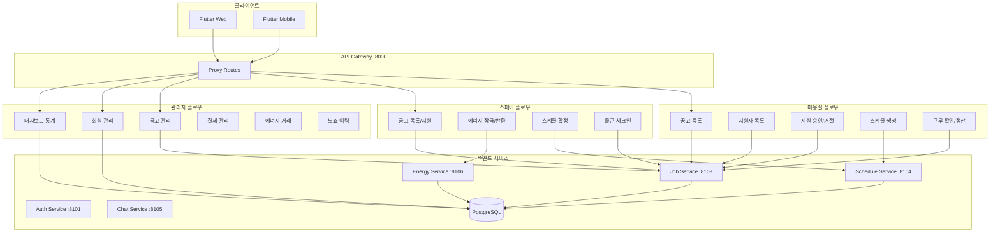
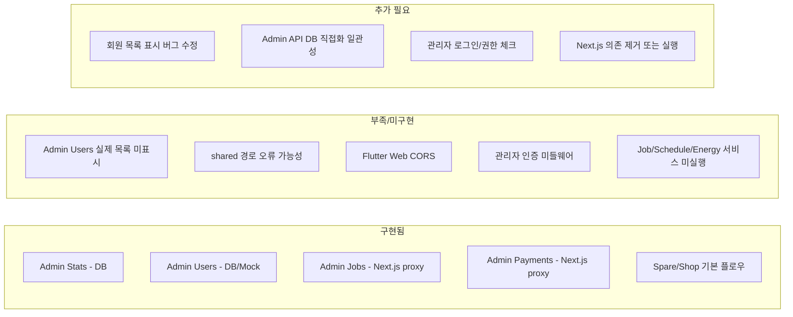

# HairSpare 아키텍처 문서

## 1. 현재 아키텍처 (관리자·백엔드·스페어·미용실 유기적 연결)

**핵심 연결 요약:**

- **관리자**: API Gateway에서 `/api/admin/*` 직접 처리 (stats, users는 DB 직접 조회; jobs, payments 등은 Next.js 프록시)
- **스페어/미용실**: API Gateway → Auth/Job/Schedule/Chat/Energy 서비스 → DB

---

## 2. 아키텍처 갭 분석 (부족한 것 / 추가 필요한 것)

| 구분 | 상태 | 비고 |
|------|------|------|
| Admin Stats | 동작 | DB 직접 조회, 대시보드 회원 수 표시됨 |
| Admin Users | 수정 진행 | DB 또는 Mock 반환, Flutter 파싱 개선 적용 |
| Admin Jobs/Payments/Energy | Next.js 의존 | `proxy_request("nextjs", ...)` - Next.js:3000 필요 |
| 스페어/미용실 | 서비스 의존 | Job:8103, Schedule:8104, Energy:8106 등 실행 필요 |

---

## 3. 서비스 포트 및 실행 순서

| 서비스 | 포트 | 실행 명령 |
|--------|------|-----------|
| API Gateway | 8000 | `cd backend-new/api-gateway && PYTHONPATH=../.. uvicorn app.main:app --host 0.0.0.0 --port 8000 --reload` |
| Auth Service | 8101 | `cd backend-new/services/auth-service && uvicorn app.main:app --port 8101 --reload` |
| Job Service | 8103 | `cd backend-new/services/job-service && uvicorn app.main:app --port 8103 --reload` |
| Schedule Service | 8104 | `cd backend-new/services/schedule-service && uvicorn app.main:app --port 8104 --reload` |
| Chat Service | 8105 | `cd backend-new/services/chat-service && uvicorn app.main:app --port 8105 --reload` |
| Energy Service | 8106 | `cd backend-new/services/energy-service && uvicorn app.main:app --port 8106 --reload` |
| Flutter Web | 8080 (기본) | `cd flutter && flutter run -d chrome` |

---

## 4. 남은 작업 (Phase 2–4)

**Phase 2 – 관리자 Admin API 일관화**
- Admin Jobs/Payments/Energy/NoShow를 DB 직접 조회로 전환 (Next.js 의존 제거)
- 또는 Next.js 3000 포트 실행 유지 및 연동 문서화

**Phase 3 – 인증 및 권한**
- 관리자 전용 로그인/토큰
- `AuthenticationMiddleware` 활성화 시 `/api/admin/*` 공개/보호 경로 정의

**Phase 4 – 마이크로서비스 실행**
- Job, Schedule, Energy 등 서비스 실행
- API Gateway config와 서비스 URL 일치 확인
