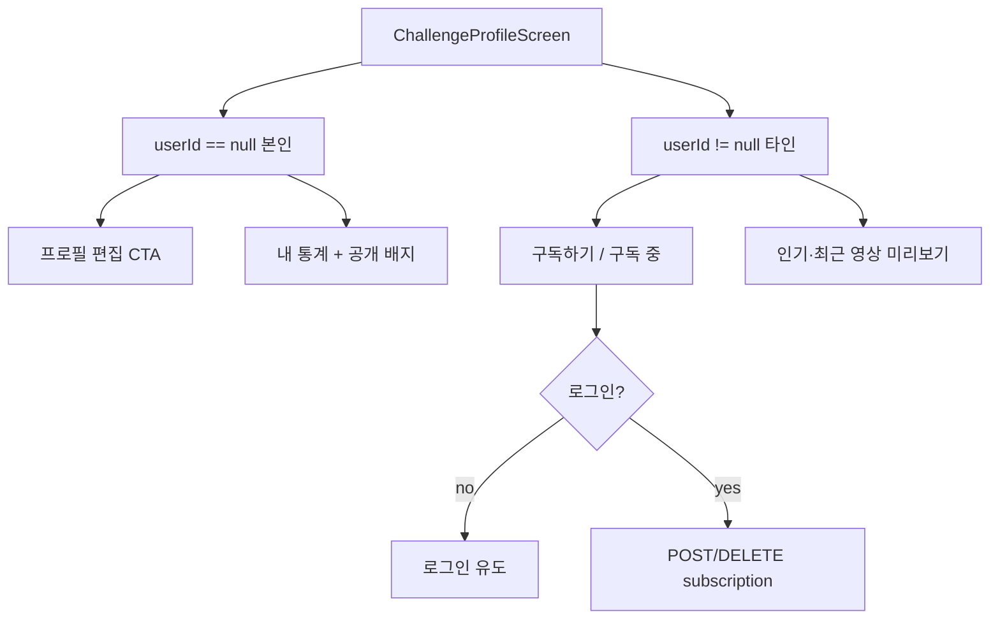

# 챌린지 프로필 리디자인 · 기능 확장 계획

> Sequential Thinking으로 정리 (2026-05-29). 구현 전 검토·우선순위 조정용.

## 1. 문제 정의

| 현재 | 문제 |
|------|------|
| 흰 박스 2개(헤더 + 통계 4열) | 시각적 계층·브랜드감 부족, **투박함** |
| 프로필 탭 하단 빈 영역 | 정보 밀도 낮음, 스크롤 목적 불명확 |
| 타인 프로필 (`userId != null`) | **구독하기 없음** (피드에만 구독 UX 존재) |
| `ChallengeProfile` 모델 | 닉네임·바이오·숫자 4개만 — 태그·대표 영상·구독 상태 없음 |

## 2. 목표

1. **보기 좋은** 크리에이터 프로필 (앱 톤: `AppTheme` 퍼플/블루 유지)
2. **타인 프로필**에서 구독/구독 취소 (기존 `SubscriptionService` 재사용)
3. **자세한 정보** 섹션으로 빈 공간 채우기 (MVP 범위 내)

## 3. 페르소나 · 화면 모드



- **본인**: `프로필 편집` (기존), 구독 버튼 **숨김**
- **타인**: `구독하기` / `구독 중` (피드 `ChallengeViewModel.handleSubscribe`와 동일 규칙)
- **비로그인**: 구독 탭 시 스낵바/로그인 유도

## 4. UI/UX 방향 (리스킨)

### 4.1 헤더

- 상단 **소프트 그라데이션 배너** (높이 ~100–120px, primaryPurple → primaryBlue 저채도)
- **아바타**를 배너 하단에 겹침 (offset −32~40px) + 얇은 흰 링
- 닉네임 · 1줄 바이오 · **전문 태그 칩** (`#헤어` `#염색` 등)

### 4.2 CTA 바 (헤더 아래)

| 모드 | Primary | Secondary (선택) |
|------|---------|------------------|
| 본인 | Filled `프로필 편집` | — |
| 타인 | Filled `구독하기` / Outlined `구독 중` | MVP 후: `공유` |

### 4.3 통계

- 4열 세로 구분선 → **2×2 미니 카드** 또는 가로 **stat chip** (숫자 `CountFormat.compact` 유지)
- 라벨: 내 영상 / 구독자 / 총 좋아요 / 총 조회수

### 4.4 프로필 탭 본문 (빈 영역 채우기)

| 섹션 | 내용 | MVP |
|------|------|-----|
| 소개 | 바이오 전체 + 링크(있을 때) | ✅ |
| 전문 분야 | 태그 칩 리스트 | ✅ mock |
| 인기 영상 | 가로 썸네일 3–5, 탭 시 챌린지/상세 | ✅ mock |
| 활동 요약 | 가입일·최근 업로드 (선택) | △ |

### 4.5 영상 탭

- 타인일 때 탭 라벨: `내 영상` → **`영상`**
- `getMyChallenges`는 본인 전용 → **`getCreatorPublicVideos(creatorId)`** mock/API 추가 필요

## 5. 데이터 · API

### 5.1 `ChallengeProfile` 확장 (제안)

```dart
// MVP 추가 필드
final bool isSubscribed;           // 서버 계산 (JWT)
final List<String> specialtyTags;  // ['헤어','염색']
final DateTime? joinedAt;
final String? externalLink;        // 인스타/샵 링크 (선택)
```

### 5.2 엔드포인트 (서버 스펙 메모)

| 동작 | 메서드 | 비고 |
|------|--------|------|
| 프로필 조회 | `GET /api/challenges/profile/:userId` | `isSubscribed` 포함 |
| 구독 | `POST /api/subscriptions/:creatorId` | 기존 |
| 구독 취소 | `DELETE /api/subscriptions/:creatorId` | 기존 |
| 구독 여부 | `GET /api/users/:creatorId/subscription-status` | 기존 `checkSubscriptionStatus` |
| 타인 공개 영상 | `GET /api/challenges/creator/:userId/videos` | **신규** |

### 5.3 Mock (`MockSpareData`)

- `_mockChallengeProfileForUserId`에 `specialtyTags`, `joinedAt` 추가
- 구독 상태: mock 맵 또는 피드 mock의 `isSubscribed`와 `creator_N` id 동기화
- `getCreatorPublicVideos(userId)` — 피드 풀에서 해당 creator 필터

## 6. 아키텍처 (코드 구조)

```
lib/view_models/challenge_profile_view_model.dart   # 신규
lib/screens/spare/challenge_profile_screen.dart     # Tab + Provider만
lib/widgets/challenge/profile/
  challenge_profile_header.dart
  challenge_profile_subscribe_bar.dart
  challenge_profile_stats_grid.dart
  challenge_profile_about_section.dart
  challenge_profile_featured_videos_row.dart
```

- **구독**: `SubscriptionService` + `GlobalMessengerService` (Context VM/Service 금지 규칙 준수)
- 피드 VM과 로직 중복 → 1차는 프로필 VM에 동일 패턴 복제, 2차에서 `CreatorSubscriptionHelper` 등 소형 유틸 추출 가능

## 7. 구현 단계 (권장 순서)

| 단계 | 범위 | 산출 |
|------|------|------|
| **P0** | 리스킨 + 위젯 분리 + 소개/태그 placeholder | 시각적 개선만, 구독 없어도 OK |
| **P1** | 타인 프로필 구독 CTA + `checkSubscriptionStatus` + 카운트 optimistic | 피드와 동일 UX |
| **P2** | mock/API 필드 + 인기 영상 가로 리스트 + 타인 영상 탭 | 빈 화면 제거 |
| **P3** | 본인: 공개 배지, 영상 탭 필터 UI polish | |
| **P4** (후순위) | 공유, 신고, 메시지하기, 링크 in bio | |

## 8. QA 체크리스트 (추가 예정)

- [ ] `creator_18` 프로필: 통계 k/m 표기
- [ ] 타인 프로필: 구독 → 구독 중 → 구독 취소, 구독자 수 변화
- [ ] 본인 프로필: 구독 버튼 없음, 편집만
- [ ] 비로그인: 구독 시 안내
- [ ] 피드에서 구독 후 프로필 진입 시 상태 일치
- [ ] 인기 영상 탭 → 해당 영상/챌린지 이동

## 9. 리스크

1. 타인 영상 API 없으면 영상 탭 빈 상태 — P2 전까지 탭 숨기거나 placeholder 문구
2. 프로필·피드 구독 상태 불일치 — 프로필 `init` 시 `checkSubscriptionStatus` 필수
3. 화면 750줄 — P0에서 분리하지 않으면 유지보수 악화

## 10. 다음 액션

1. 이 문서에서 **P0~P1 범위** 확정 (전부 vs 단계적)
2. P0 UI 목업 승인 후 구현
3. `MVP_QA_CHECKLIST.md`에 §챌린지 프로필 항목 반영
