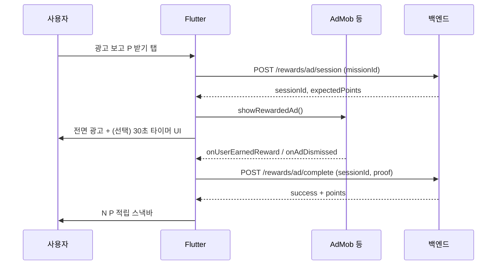

# 미션 · 보상형 광고 (리워드) — 향후 설계 v1

> 상태: **기획 확정용** (현재 MVP Must 제외, 포인트 화면 UI만 존재)  
> 관련 화면: `lib/screens/spare/points_screen.dart` (간단/참여/구매/배너 placeholder)

---

## 1) 한 줄 요약

포인트 적립은 **미션 타입별로 “행동 → 인증 → 서버 지급”**이 같고,  
**보상형 광고(리워드 광고)** 는 그중 **`rewarded_ad` 타입**으로 넣는다.  
(30초 타이머 + 광고 시청 완료 콜백 후 P 지급)

---

## 2) 미션 타입 전체 맵

| type | UI 섹션(예) | 사용자 행동 | 인증 방식 | 포인트 예 |
|------|-------------|-------------|-----------|-----------|
| `daily` | 오늘의 미션 | 출석체크 등 | 앱 버튼 1회 | 10P |
| `simple` | 간단미션 | 외부 링크(구독·팔로우) | **스크린샷 업로드** + 자동/수동 검증 | 77~94P |
| `participation` | 참여미션 | 방문·클릭 N초·음악 재생 | **앱 내 타이머/체류** 추적 | 1~3P |
| `purchase` | 구매미션 | 상품 구매 | **주문/영수증** 업로드 + 검증 | 50~100P |
| `rewarded_ad` | (전용 행 또는 간단미션 상단) | **광고 시청** | **광고 SDK 완료 콜백** + 서버 검증 | 정책별 (예: 5~20P) |

공통: 목록의 **○P 버튼** → **미션/광고 상세** → 조건 충족 → **서버 `complete`** → 잔액 반영.

---

## 3) 보상형 광고 (Rewarded Ad) 흐름

### UX (목표)

1. **「광고 보고 ○P 받기」** 진입
2. 로딩 → **전면 리워드 광고** 재생
3. (정책에 따라) 화면에 **남은 시간 30초** 등 카운트다운 표시  
   - 실제 종료는 **SDK “시청 완료” 이벤트** 기준 (타이머만으로 지급 X)
4. **시청 완료** → 서버 확인 → 포인트 지급
5. **중도 이탈 / 로드 실패** → 지급 없음, 「시청을 완료해 주세요」+ 재시도

### 실패·재시도

| 상황 | 처리 |
|------|------|
| 광고 로드 실패 | 「잠시 후 다시 시도」 |
| N초 전 닫기 | 지급 없음, 재시도 허용(일일 횟수 제한) |
| 위조/중복 session | 서버 거절 |
| 일일 한도 초과 | 「오늘은 모두 참여했어요」 |

---

## 4) 간단미션 / 참여미션 / 구매미션 (요약)

### 간단미션 (`simple`)

- 외부 URL → 사용자 행동 → **스크린샷 업로드**
- 불일치 시 안내 + **재업로드**

### 참여미션 (`participation`)

- WebView·인앱 재생 등 → **체류/재생 시간** 앱이 측정
- 20초 보기, 음악 듣기, SSG 방문 등

### 구매미션 (`purchase`)

- 구매 링크 → **주문 증빙** 업로드
- 취소/환불 시 회수 정책

---

## 5) 서버·클라이언트 세팅 (나중에 구현 시)

### API (예시)

- `GET /api/points/missions?type=simple|participation|purchase|rewarded_ad`
- `POST /api/points/missions/{id}/sessions` — 스크린샷/광고 세션 시작
- `POST /api/points/missions/{id}/complete` — 검증 후 지급 (JWT 필수)
- `POST /api/points/rewards/ad/callback` — (선택) AdMob S2S

### Flutter

- `MissionType` enum + `Mission` 모델에 `verificationKind`, `externalUrl`, `minDwellSeconds`, `adUnitId` 등
- **광고**: Google AdMob `RewardedAd` (또는 mediation) — **키는 `--dart-define`**, 릴리스 mock off
- **ViewModel**: `RewardedAdMissionViewModel` — UI 타이머 + SDK 콜백만, 지급은 API
- `points_screen` → 탭 시 타입별 라우트 (`/spare/points/mission/:id`)

### 보안 (필수)

- 클라이언트만으로 P 증가 금지
- 리워드 광고는 **SDK reward id + server session** 매칭
- 스크린샷/구매는 **서버 OCR·수동 검수** 단계적 도입 가능

### 운영 정책 (정해야 할 것)

- 일일 리워드 광고 **횟수 상한** (예: 10회/일)
- 미션·광고별 **쿨다운**
- Spare / Shop 동일 정책 여부
- 미성년·개인정보·광고 SDK 약관

---

## 6) MVP 범위와의 관계

| 항목 | MVP v1 (`MVP_SCOPE_V1.md`) | 이 문서 |
|------|---------------------------|---------|
| 포인트 목록 UI | mock 탭 즉시 지급 | 유지 가능 |
| 미션 상세·검증 | **제외** | Phase 2+ |
| 보상형 광고 SDK | **제외** | Phase 2+ (인프라 먼저 설계) |

**지금 할 일:** 이 문서로 타입·API·UX 합의만 해 두고, 구현은 **백엔드 + AdMob 계정** 준비 후 착수.

---

## 7) 구현 순서 제안 (나중)

1. `Mission` API + 타입 enum (`simple` / `participation` / `purchase`)
2. 간단미션: 상세 + 스크린샷 업로드 + 서버 검증
3. 참여미션: WebView 체류 타이머
4. **보상형 광고**: AdMob 연동 + session/complete API
5. 구매미션: 주문 증빙

확정일: 2026-05-29
